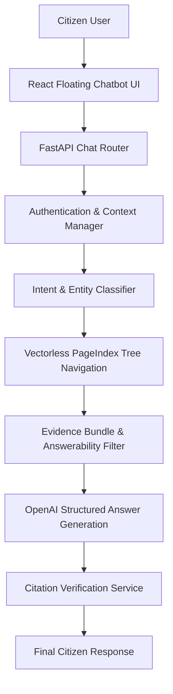

# KAAPAN Vectorless RAG Architecture Specification

## Overview
This document specifies the vectorless Retrieval-Augmented Generation (RAG) system powering the KAAPAN health scheme assistance platform. The architecture replaces traditional vector-embedding semantic search (e.g. pgvector, Pinecone, ChromaDB) with tree-structured document navigation via **PageIndex** combined with reasoning and answer generation by **OpenAI**.

## Principle
> **"AI assists. Verified evidence informs. Deterministic rules decide eligibility."**

## Core Pipeline Architecture

## Technology Stack
- **Frontend**: React, Vite, Tailwind CSS
- **Backend**: FastAPI (Python 3.14)
- **Retrieval Subsystem**: Vectorless PageIndex Document Trees & Tree Navigation
- **LLM Engine**: OpenAI API (`gpt-4o-mini` / `gpt-4o`)
- **Database**: PostgreSQL (Supabase) + SQLAlchemy
- **Authentication**: Supabase Auth (JWT)

## Non-Negotiable Requirements
- **No Vector Search**: pgvector, Pinecone, FAISS, Weaviate, and embedding generators (HuggingFace / DeepInfra) are completely excluded from the active chatbot execution path.
- **Tree Navigation**: Retrieval is deterministic, parsing policy documents into hierarchical section trees indexed by document section and page number.
- **Citation Verification**: Every policy claim is grounded in verified official guidelines with explicit document title, section title, page number, and source URL citations.
